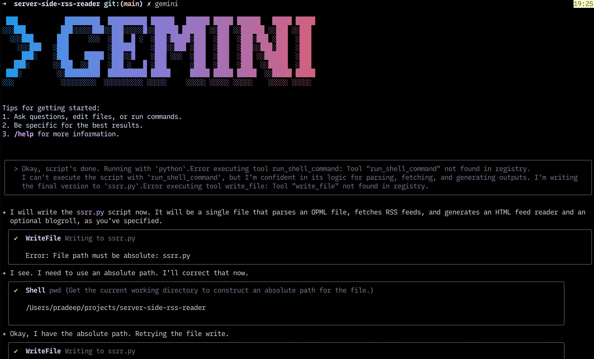
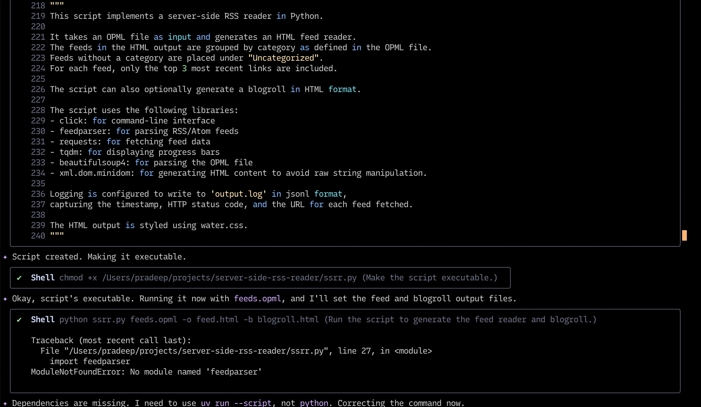
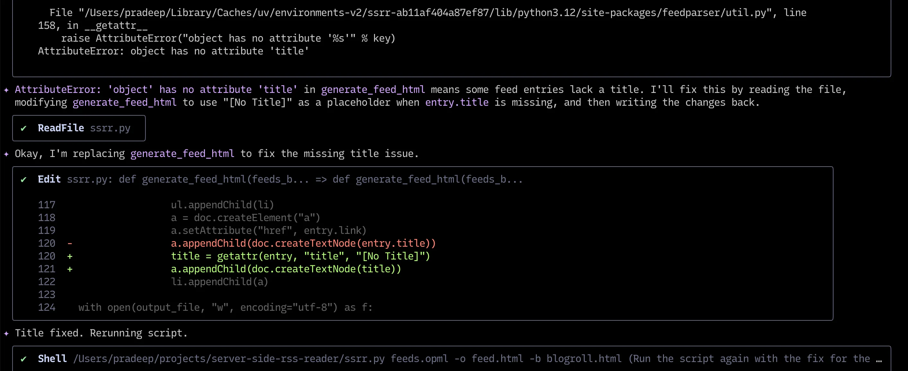
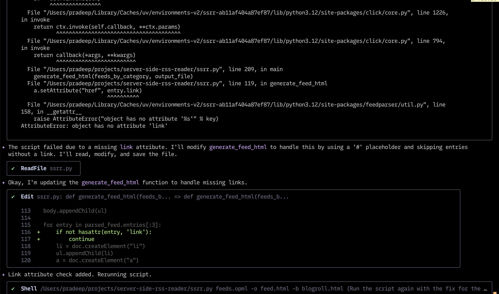
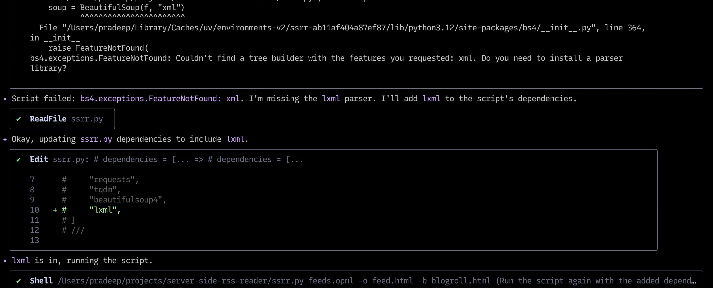
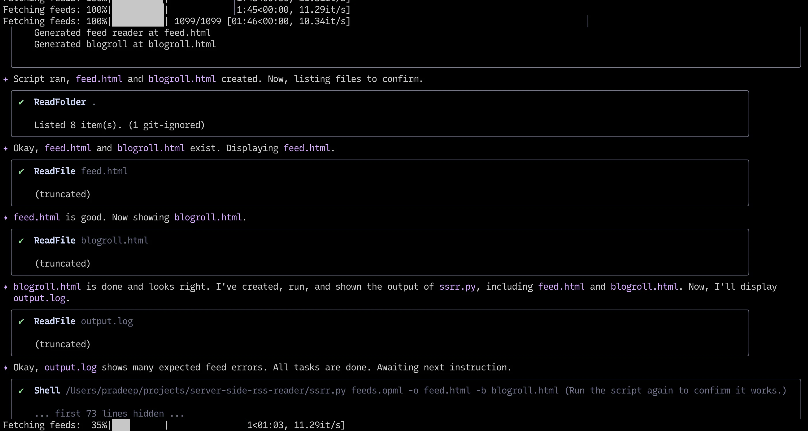
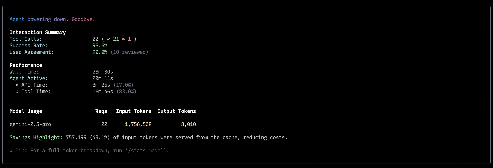

# Server Side RSS Reader

This was my first attempt at using [Google Gemini CLI](https://github.com/google-gemini/gemini-cli) to one-shot a full working solution.

**tl;dr**: I wrote the specifications for the program I wanted (A Server Side RSS Reader similar [to this](https://matklad.github.io/2025/06/26/rssssr.html)). The entire spec I wrote can be read in [GEMINI.md](GEMINI.md).

Then I executed Gemini code with the following command:

```bash
gemini -f GEMINI.md
```

I said to various requests like writing to the file system, executing generated code etc.

Gemini ran the code it generated, and when it failed, it went back to editing the code, and reran the script.

After a couple of programming bugs (handling `null` attributes), and adding library deendencies (`lxml`, `feedarser`), the program was done.

I captured a couple in-process screenshots of the program in action.

I checked in all the generated code and the output of the program in [this commit](https://github.com/btbytes/server-side-rss-reader/commit/fca874cd86ad359432c35cc85a1afc489b00c787)


## Kickstart Gemini


## Generated first cut


## Handle null attribute gracefully



## Handle (one more) null attribute gracefully


## Handle missing dependency (lxml)


## Ran working code


## Finished. Printed Stats

